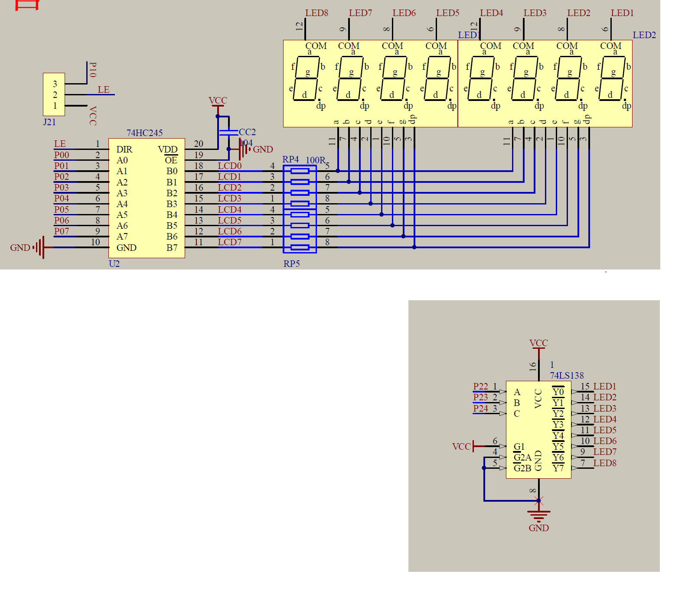
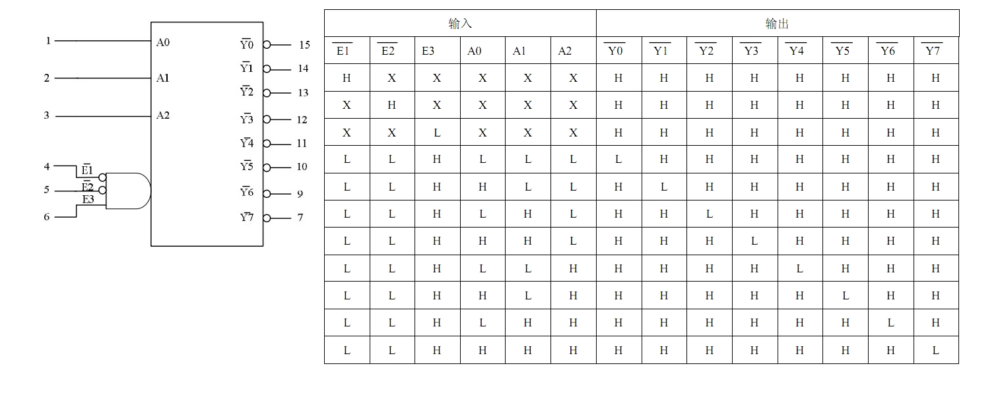
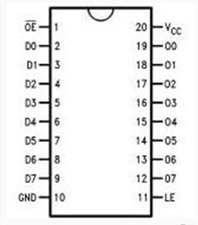

# 接线图

> 使用38译码器，A B C 分别接P2_2,P2_3,P2_4
> 使用245锁存器，接入P0引脚

## 动态数码管显示原理

动态显示的特点是将所有数码管的段选线并联在一起，由位选线控制是哪一位数码管有效。选亮数码管采用动态扫描显示。谓动态扫描显示即轮流向各位数码管送出字形码和相应的位选，利用发光管的余辉和人眼视觉暂留作用，使人的感觉好像各位数码管同时都在显示。动态显示的亮度比静态显示要差一些，所以在选择限流电阻时应略小于静态显示电路中的。

## 控制原理

使用P0口并行输入需要的显示数据，P2口选择点亮的数码管。

## 38译码器

D74HC138D 是一种三通道输入、八通道输出译码器

## 74H573锁存器

* OE为使能端，当他为低电平的时候， 锁存器开始工作
* VCC和GND为电源和地端
* LE为锁存端，当LE为高电平的时候，Q0~Q7都跟D0~D7状态一样，当LE为低电平的时候，Q0~Q7都锁存数据，无论D0~D7怎么变化，Q0~Q7都保持锁存之前的那个状态。
